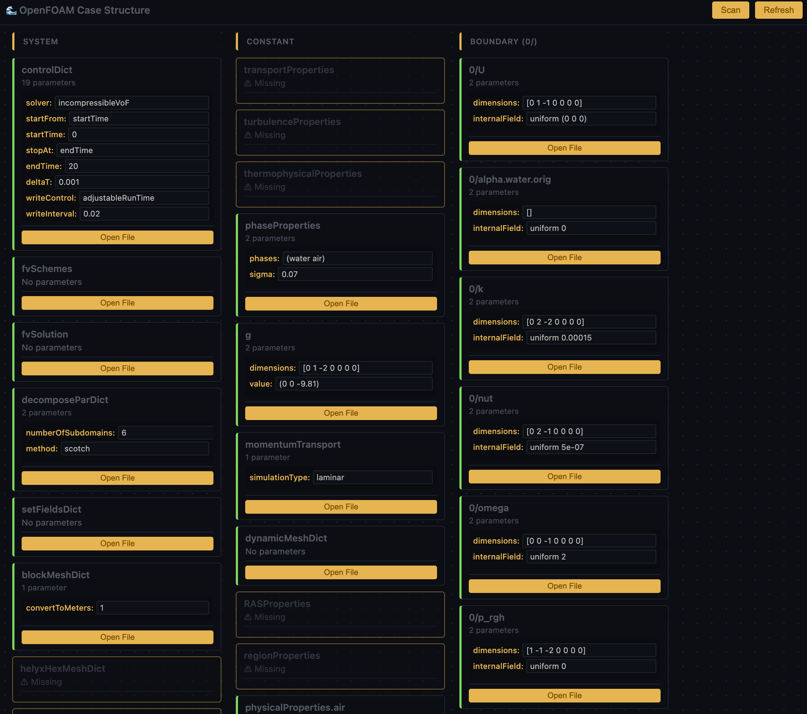

# OpenFOAM Language Support for VS Code


A comprehensive VS Code extension providing syntax highlighting, IntelliSense, and workflow management for OpenFOAM dictionary files.

## ✨ Features

### 🎨 Syntax Highlighting

Color-coded tokens for keywords, values, comments, strings, and numbers with full OpenFOAM dictionary syntax support.

### 🧠 IntelliSense

- **Hover Information**: Detailed documentation for 100+ OpenFOAM keywords
- **Auto-Completion**: Context-aware suggestions with parameter templates
- **Signature Help**: Parameter information while typing

### 📋 Outline View

Hierarchical document structure with colored icons:

- 🔵 **Blue** - FoamFile headers, geometry blocks
- 🟡 **Yellow** - Scheme blocks (fvSchemes, fvSolution)
- 🟣 **Purple** - Solver settings, boolean values
- 🔵 **Cyan** - Mesh controls, numeric values
- 🟠 **Orange** - Layer controls, string values
- 🟢 **Green** - Properties, field values

### 🔧 Workflow Panel

Interactive case management with parameter editing:

- **System Files**: controlDict, fvSchemes, fvSolution, helyxHexMeshDict, caseSetupDict
- **Constant Files**: transportProperties, turbulenceProperties, RASProperties
- **Boundary Conditions**: All 0/ directory field files
- **Inline Editing**: Modify parameters directly in the workflow view

### 📁 Auto-Detection

Automatically recognizes OpenFOAM files in:

- `system/` directory (controlDict, fvSchemes, etc.)
- `constant/` directory (transportProperties, etc.)
- Time directories (`0/`, `1/`, `0.5/`, etc.)
- Files without extensions (U, p, k, epsilon, etc.)

## 🚀 Installation

### Quick Install (Recommended)

```bash
# Download and install the latest .vsix file
code --install-extension openfoam-language-support-0.4.0.vsix
```

### From Source

```bash
git clone https://github.com/arefhm94/openfoam-vscode-extension.git
cd openfoam-vscode-extension
npm install
npm run compile
npm run extract-keywords  # Extract from OpenFOAM source
code --install-extension openfoam-language-support-0.4.0.vsix
```

## 📖 Usage

### Basic Workflow

1. Open any OpenFOAM case directory
2. Files automatically detect as OpenFOAM language
3. Use `Ctrl+Shift+O` for outline navigation
4. Click the graph icon (📊) for workflow panel
5. Hover over keywords for documentation

### Outline View Example

```text
📁 FoamFile
📁 ddtSchemes
  📄 default: Euler
📁 gradSchemes
  📄 default: Gauss linear
📁 divSchemes
  📄 div(rhoPhi,U): Gauss upwind
📁 laplacianSchemes
  📄 default: Gauss linear corrected
```

### Workflow Panel Example



## 🔧 Commands

- `OpenFOAM: Open Case Workflow` - Launch interactive workflow panel
- `OpenFOAM: Refresh Keyword Database` - Update from OpenFOAM source
- `OpenFOAM: Set Language Mode` - Manually set file language

## 📋 Supported Files

### System Directory

- `controlDict` - Simulation control
- `fvSchemes` - Discretization schemes
- `fvSolution` - Solver settings
- `helyxHexMeshDict` - Helyx mesh generation
- `caseSetupDict` - Helyx case configuration
- `fvOptions` - Source terms
- `topoSetDict` - Topology manipulation

### Constant Directory

- `transportProperties` - Physical properties
- `turbulenceProperties` - Turbulence models
- `RASProperties` - Reynolds-Averaged Simulation
- `phaseProperties` - Multi-phase settings
- `g` - Gravity vector
- `momentumTransport` - Transport models

### Boundary Conditions (0/ directory)

- `U` - Velocity field
- `p`, `p_rgh` - Pressure fields
- `k`, `epsilon`, `omega` - Turbulence fields
- `alpha.*` - Phase fraction fields
- `T` - Temperature field

## 🔄 Version History

### 0.4.0 (Latest)

- ✅ **Colored outline icons** with semantic categorization
- ✅ **Enhanced Helyx support** (helyxHexMeshDict, caseSetupDict)
- ✅ **Auto-detection** for files in OpenFOAM directories
- ✅ **Improved outline parsing** for complex dictionary structures

### 0.3.0

- ✅ **Workflow panel** with parameter editing
- ✅ **Boundary condition scanning** from 0/ directory
- ✅ **Inline parameter editing** in workflow view

### 0.2.0

- ✅ **Helyx file support** (RASProperties, regionProperties)
- ✅ **Extended system files** (fvOptions, topoSetDict, etc.)

### 0.1.0

- ✅ **Basic syntax highlighting** for OpenFOAM dictionaries
- ✅ **IntelliSense** with 100+ keywords
- ✅ **Keyword extraction** from OpenFOAM source

## 🛠️ Development

### Project Structure

```text
├── src/
│   ├── extension.ts                 # Main extension
│   ├── workflow/WorkflowPanel.ts    # Workflow UI
│   ├── providers/                   # Language features
│   └── extractor/                   # Keyword extraction
├── syntaxes/openfoam.tmLanguage.json # Syntax grammar
├── data/openfoam-keywords.json      # Keyword database
└── examples/                        # Test cases
```

### Building

```bash
npm run compile          # Build TypeScript
npm run extract-keywords # Generate keyword database
vsce package            # Create .vsix package
```

## 🤝 Contributing

Contributions welcome! Areas for improvement:

- Keyword coverage expansion
- Parser improvements (AST-based)
- Diagnostic capabilities
- Test coverage

## 📄 License

GPL-3.0 (same as OpenFOAM)

---
